<a href="https://garvitmaheshwari.in">
  
</a>

<p align="center">
  <a href="https://garvitmaheshwari.in"></a>
  <a href="https://www.linkedin.com/in/garvit-maheshwari-34185328a/"></a>
  <a href="mailto:wickedsoni27@gmail.com"></a>
  
</p>

<br>


```kotlin
object Garvit : AndroidDeveloper() {
    val basedIn       = "Chennai, India"
    val studying      = "B.Tech CSE (Software Engineering), class of 2027"
    val building      = "WiFiLens: an offline Wi-Fi analyzer that predicts coverage from a floor plan"
    val stack         = listOf("Kotlin", "Jetpack Compose", "Coroutines + Flow", "Room", "Hilt", "Koin", "KMP")
    val architecture  = "Clean Architecture + MVI, multi-module, pure-Kotlin cores that test without a device"
    val learning      = listOf("Kotlin Multiplatform", "System design", "DSA for placements")
    val lookingFor    = "Android / SDE internships, 2026–27"

    override fun funFact() = "Every chart on this page is redrawn by a GitHub Action each morning."
}
```


<p align="center">
  <a href="https://github.com/Wickedsoni/Wifilens"></a>
  <a href="https://github.com/Wickedsoni/SpendSense"></a>
  <a href="https://github.com/Wickedsoni/MyAdvisor"></a>
  <a href="https://github.com/Wickedsoni/WebBanking"></a>
</p>

<details>
<summary><b>More things I've built</b></summary>
<br>

| Project | What it is |
|---|---|
| [**AttendGuard**](https://github.com/Wickedsoni/attendguard) | Kotlin CLI that tracks attendance against the 75% rule. Built as the system under test for a QA course, with requirements traced in Kiwi TCMS. |
| [**Movie_app**](https://github.com/Wickedsoni/Movie_app) | Movie recommendations tuned by mood, time of day and who you're watching with. |
| [**Landrop**](https://github.com/Wickedsoni/Landrop) | Quick file sharing in the browser. |
| **GigGuard** | Parametric income insurance for gig workers. Guidewire DEVTrails, Jan 2026. |
| **DesignLoop** | Gamified Android app that teaches software architecture. Compose, Firebase, Hilt, Clean Architecture. |

</details>




<p align="center">
  
  
  
</p>


<p align="center">
  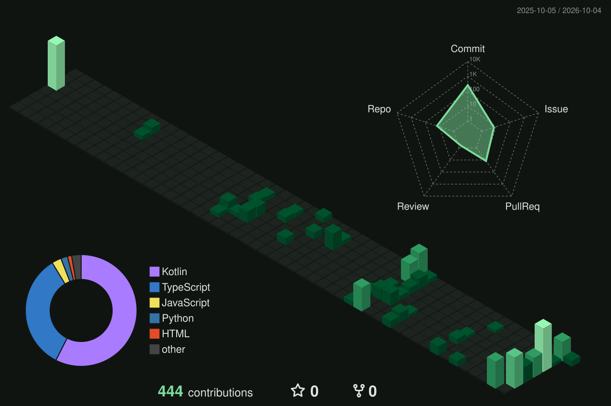
</p>

<p align="center">
  <picture>
    <source media="(prefers-color-scheme: dark)" srcset="assets/generated/snake-dark.svg">
    <source media="(prefers-color-scheme: light)" srcset="assets/generated/snake-light.svg">
    
  </picture>
</p>

<details>
<summary><b>Experience & community</b></summary>
<br>

- **Trainee Intern, Cloud CRM & SaaS Development · Salesforce** (Jan 2026, remote). Apex, Lightning components, Salesforce certified.
- **Core organiser · Day Zero Hackathon (CODENEX).** 36-hour national hackathon, 3000+ teams.
- **Member · HackTheBox university chapter (StickyBit), 1.5 years.** CTFs, security workshops, organising committee for the annual CTF.
- **Non-Technical Head · IEEE GRSS student chapter.** Corporate outreach, team coordination, event logistics.
- **Trainee Lead · Alumni Affairs, 1.5 years.** Alumni engagement, photography, membership drives.

</details>

<details>
<summary><b>Meet Ping, my mascot</b></summary>
<br>

<p align="center">
  
  
  
  
  
</p>

<p align="center">A living signal made of code brackets, with a Wi-Fi antenna and a terminal cursor for a mouth. It shows up across my repos: coding when work is in progress, celebrating when tests pass, glitching when something breaks.</p>

</details>


<p align="center"></p>

<p align="center">
  I'm looking for <b>Android or SDE roles</b> where I can learn from strong engineers and ship real products.<br>
  The fastest way to reach me is <a href="mailto:wickedsoni27@gmail.com">wickedsoni27@gmail.com</a>, or have a look around <a href="https://garvitmaheshwari.in">garvitmaheshwari.in</a>.
</p>

<p align="center"><br><sub>Images are self-hosted SVGs, redrawn daily by <a href=".github/workflows/refresh-profile.yml">GitHub Actions</a>.</sub></p>
